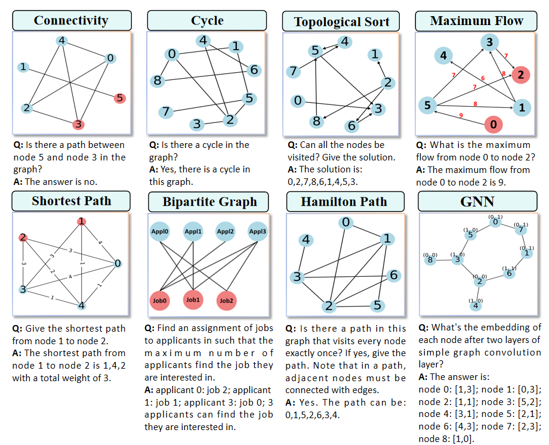
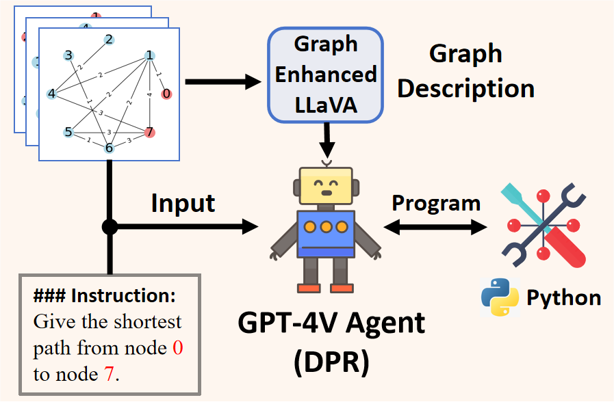

# VisionGraph: Leveraging Large Multimodal Models for Graph Theory Problems in Visual Context

<div align="center">

 [Overview](https://github.com/HITsz-TMG/VisionGraph#sparkles-overview) | [News](https://github.com/HITsz-TMG/VisionGraph#fire-news) | [Illustration](https://github.com/HITsz-TMG/VisionGraph#rocket-illustration) | [Citation](https://github.com/HITsz-TMG/VisionGraph#citation)

</div>


## :sparkles: Overview

This repository contains the official implementation of our **ICML 2024** paper, [**VisionGraph: Leveraging Large Multimodal Models for Graph Theory Problems in Visual Context**](https://arxiv.org/abs/2405.04950).

VisionGraph, is a benchmark used to explore the capabilities of advanced LMMs in solving multimodal graph theory problems. It encompasses eight graph problem tasks, from connectivity to shortest path problems. To step forward in this direction, we introduce a Description-Program-Reasoning (DPR) chain to enhance the logical accuracy of reasoning processes through graphical structure description generation and algorithm-aware multi-step reasoning. All prompts, datasets, checkpoints and evaluation methods related to VisionGraph and DPR are available in this repo for easy access and utilization.

**Graph Data for VisionGraph** can be accessed [here](https://huggingface.co/datasets/MrSunshy/VisionGraph_hf).
**Graph Understanding Data for Training** can be accessed [here](https://huggingface.co/datasets/MrSunshy/VisionGraph_GraphStructure_hf).

If you have any question, please feel free to contact me via email at liyunxin987@163.com or submit your issue in the repository.

## :fire: News

[24.05.08] We have updated our paper.

[24.05.11] We release the prompts, datasets, checkpoints and evaluation methods related to VisionGraph and DPR.

## :rocket: Illustration

[Here](https://arxiv.org/abs/2405.04950), you can see the detailed introduction of VisionGraph and DPR.

<p align="center" width="60%"></p>

<p align="center" width="60%"></p>


## Citation
```
@article{li2024visiongraph,
    title={VisionGraph: Leveraging Large Multimodal Models for Graph Theory Problems in Visual Context}, 
    author={Yunxin Li and Baotian Hu and Haoyuan Shi and Wei Wang and Longyue Wang and Min Zhang},
    journal={arXiv preprint arXiv:2405.04950},
    year={2024},
}
```
